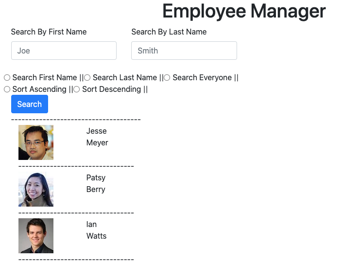
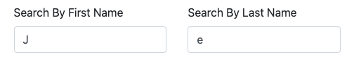
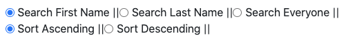

# React Employee Tracker

## Created as a test project to start experimenting with the React engine

[Click Here to Try the App](https://morning-mesa-90781.herokuapp.com/)

### When you first arrive, you'll see this landing page.

### Search employees by first or last name by typing in the appropriate search bar.

#### Note: case-insensitive

### Use the top 3 radio buttons to decide if you want to search by first name, last name, or just see everyone.
### Use the bottom 2 to decide if you want the results in Ascending or Descending order.

### Press the search button when ready.

### Your search results will be displayed below.

